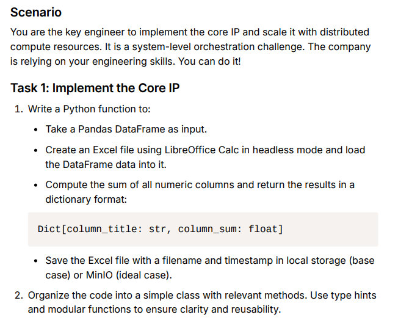
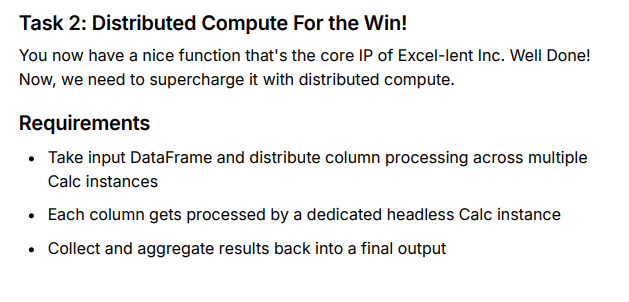
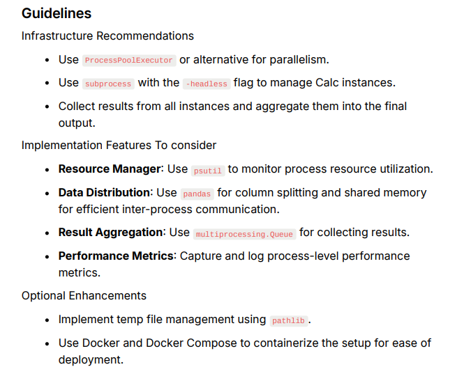

# exercises
This exercise aims to assess technical skill for a senior infrastructure engineer position.

## task-a: Design Exercise: Deployment Strategy for "Uni-Corn LLC"
**Scenario**
Your solution needs to support both tech-savvy mega-farms (who want cloud
SaaS) and traditional family farms (who want everything running on their loca
network with no internet).

**Tech Stack**
- Backend: FastAPI serving corn optimization algorithms.
- Frontend: Dash dashboard showing real-time crop analytics.
- Database: PostgreSQL storing sensor data and crop metrics.
- ML: Models predict optimal harvest times (training does not need to b done on this infrastructure).

**Requirements**
**Deployment Modes**
The app is deployed on various infrastructures, from large corporate farms with
tons of cloud compute demand to smaller family farms with air-gapped local
networks. 
Examples:
- Cloud SaaS for mega-farms with multiple locations.
- On-premise deployment for farms without internet.
- Hybrid mode for farms with intermittent connectivity.


**Data & Security**
Each client is very protective of their data. We must demonstrate that their data
is safe and managed responsibly. 


**Operations**
Usage is peaky - intense during harvest season or when weather is good, then
quiet during weekends and off-season. How do we scale resources during
peak planting/harvest seasons?

**Guidelines**
The CEO believes we should optimize for simplicity and portability: design for
on-prem, no-internet deployment first, then extend to cloud. The vision is one
codebase running on standard VMs and containers, avoiding cloud-managed
services. This means everything from PostgreSQL to monitoring runs in
containers, making it portable across any infrastructure - from Digital Ocean to
a farmer's local network.
Key architectural decision points:
- Building on portable components (PostgreSQL, Prometheus, etc.) vs cloudmanaged services
- Standardizing on VM  container architecture vs cloud-native patterns
- Designing monitoring, logging, and updates to work without external
dependencies


## task-b: Coding Exercise: Distributed Compute System
**task-b1: Implement Core IP**


**task-b2: Scale the Core IP with distribute compute**




## Folder Structure
```bash
/exercises/
├── task-a/                      
│     └── README.md              # task-a deliverable
│  
├── task-b/   
│     ├─── task-b1/              # folder containing task-b1 deliverable
│     │               
│     └─── task-b2/              # folder containing task-b1 deliverable
└── README.md                    # Repo README.md
```