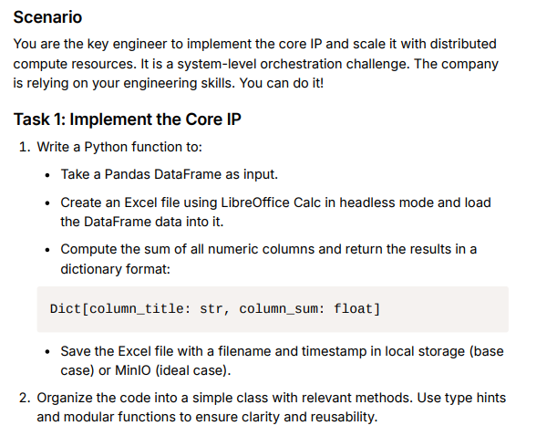
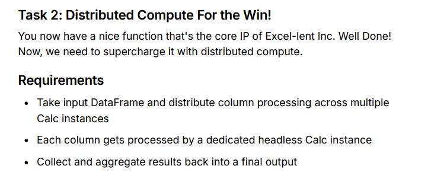
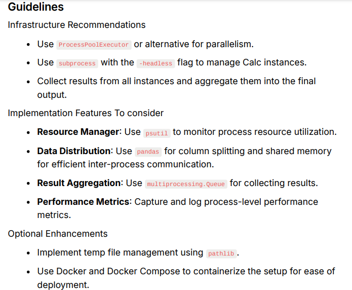

# task-b: Distributed Compute System

## task-b1



## task-b1



## task-b2

 <br>


## Folder Structure
```bash
/exercises/
├── task-a/                      
│     └── README.md              # task-a deliverable
│  
├── task-b/   
│     ├─── task-b1/              # folder containing task-b1 deliverable
│     │               
│     └─── task-b2/              # folder containing task-b1 deliverable
└── README.md                    # Repo README.md
```